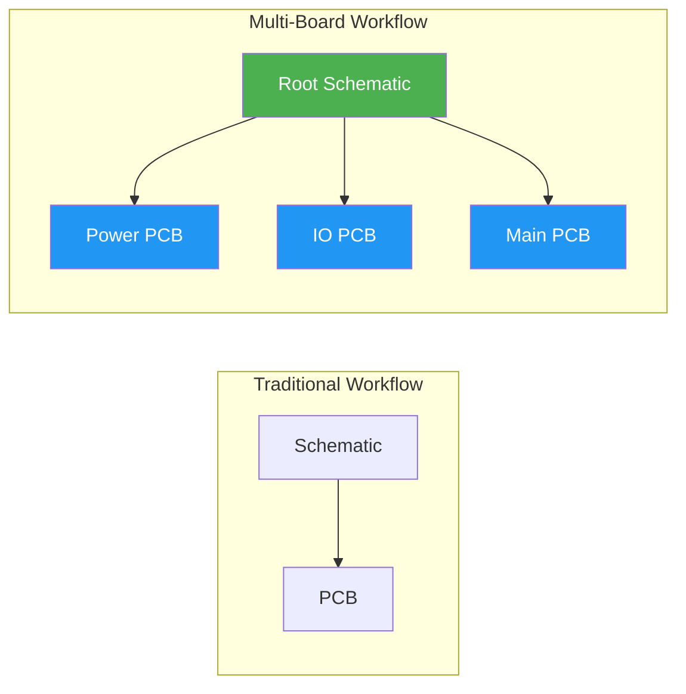
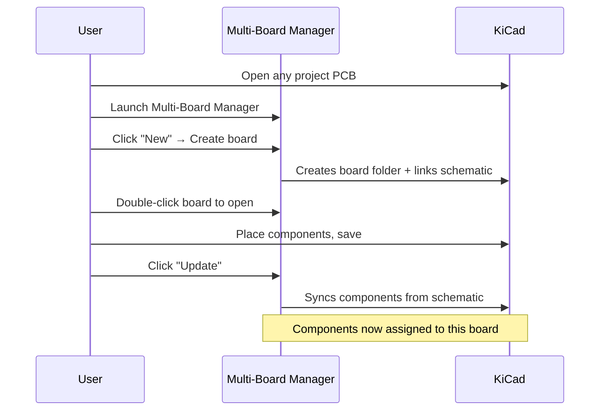
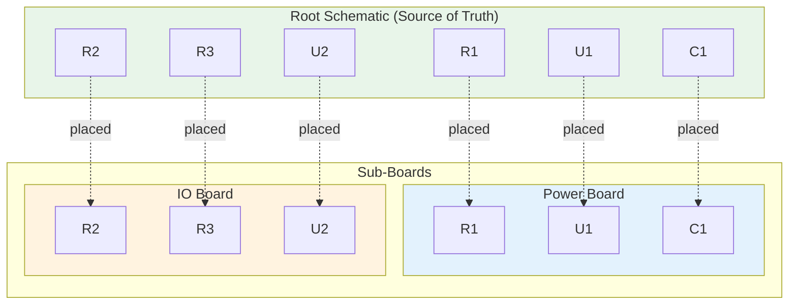
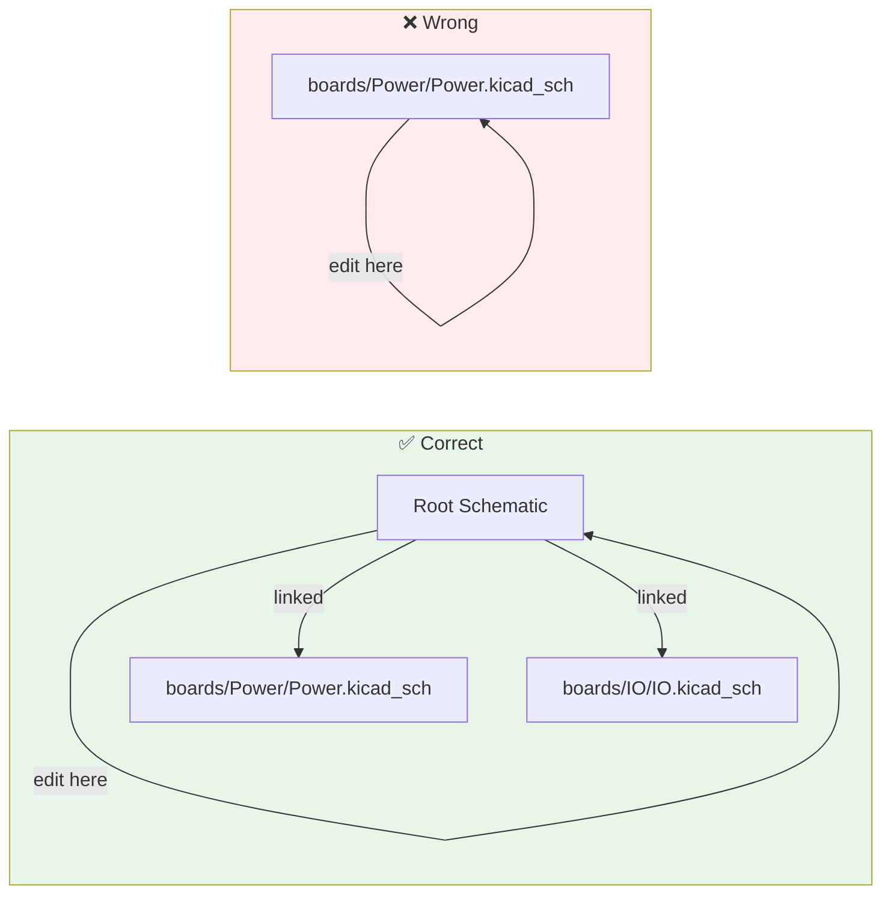
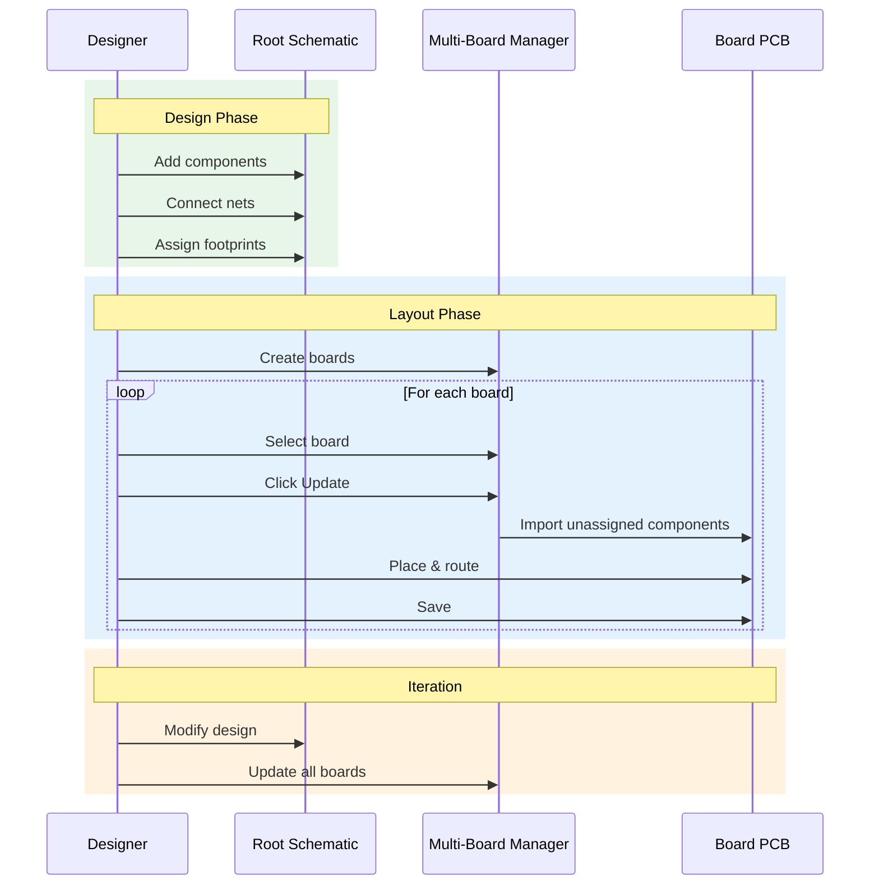
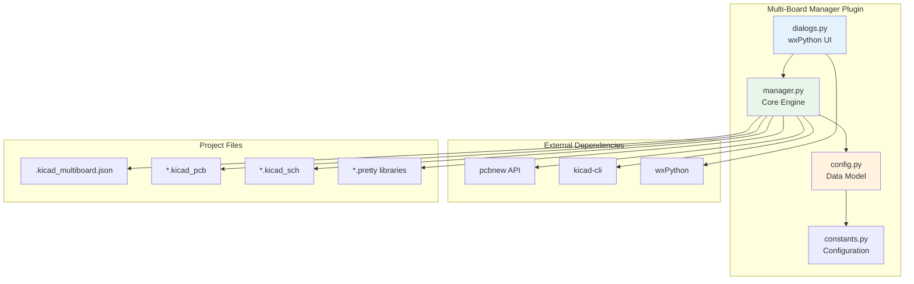
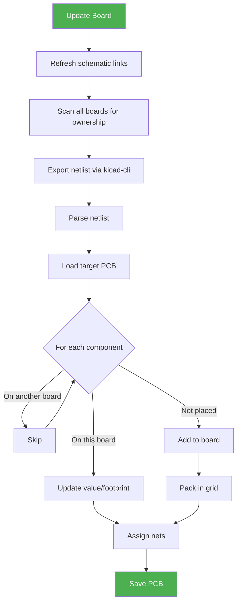
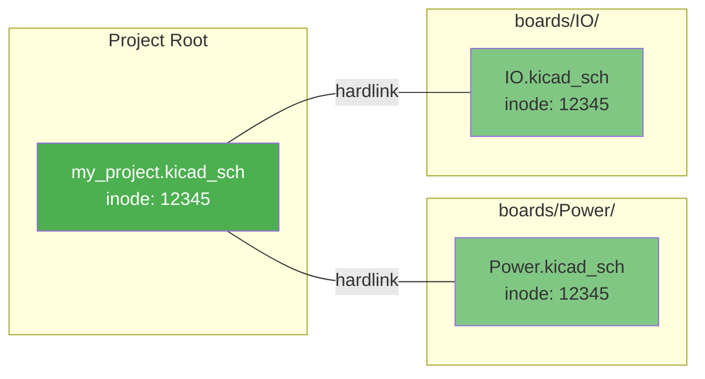
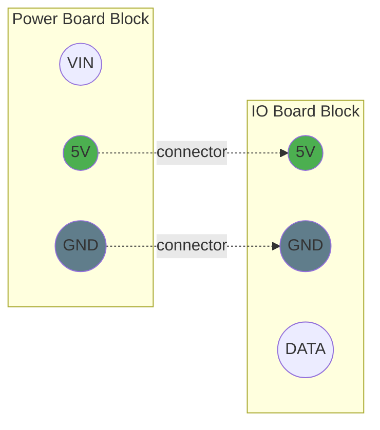

# Multi-Board PCB Manager

[](https://www.kicad.org/)
[](LICENSE)
[](https://www.python.org/)

A KiCad Action Plugin that lets you manage **multiple PCB files** ("sub-boards") that all share **one schematic**.

## Table of Contents

- [Why This Exists](#why-this-exists)
- [Key Features](#key-features)
- [Installation](#installation)
- [Quick Start](#quick-start)
- [Core Concepts](#core-concepts)
- [Workflow Guide](#workflow-guide)
- [Project Structure](#project-structure)
- [Architecture](#architecture)
- [Ports (Inter-Board Connections)](#ports-inter-board-connections)
- [Troubleshooting](#troubleshooting)
- [Contributing](#contributing)
- [License](#license)

---

## Why This Exists

KiCad excels at "one schematic → one PCB" workflows. But real-world projects often need:

- **Multiple PCBs** from a single schematic (rigid-flex, daughterboards, panelized variants)
- **A single source of truth** for symbols, connectivity, and BOM data
- **No proprietary meta-formats** — just standard KiCad files

This plugin provides a pragmatic solution that stays 100% compatible with native KiCad formats.



---

## Key Features

- ✅ **Single Source of Truth** — One schematic drives all boards (via hardlinks/symlinks)
- ✅ **Automatic Component Assignment** — Components belong to whichever board they're placed on
- ✅ **Smart Netlist Sync** — Updates values, footprints, and nets without losing layout
- ✅ **Inter-Board Ports** — Define connection points between boards
- ✅ **Block Footprints** — Visual board representations for assembly documentation
- ✅ **Health Reports** — Track board status and component distribution
- ✅ **DRC Integration** — Run connectivity checks across all boards

---

## Installation

### Requirements

- **KiCad 9.0+** (developed and tested on 9.x)
- **Python 3.9+** (ships with KiCad)
- **kicad-cli** in PATH (installed with KiCad)

### Installation Steps

#### Option 1: Install Script (Recommended)

**Linux/macOS:**
```bash
chmod +x install.sh
./install.sh
```

**Windows:**
```cmd
install.bat
```

#### Option 2: Manual Installation

Copy the plugin folder to your KiCad plugins directory:

| OS | Path |
|---|---|
| **Windows** | `%APPDATA%\kicad\9.0\scripting\plugins\` |
| **Linux** | `~/.local/share/kicad/9.0/scripting/plugins/` |
| **macOS** | `~/Library/Application Support/kicad/9.0/scripting/plugins/` |

After installation:
1. Open KiCad PCB Editor
2. Go to **Tools → External Plugins → Refresh Plugins**
3. Access via **Tools → External Plugins → Multi-Board Manager**

---

## Quick Start



### Step-by-Step

1. **Open your project** — Any PCB in the project works
2. **Launch the plugin** — Tools → External Plugins → Multi-Board Manager
3. **Create a board** — Click "New", enter a name (e.g., "Power")
4. **Open the board** — Double-click or press Enter
5. **Place components** — Drag footprints from the schematic
6. **Save and Update** — Return to the manager, click "Update"

---

## Core Concepts

### The Ownership Rule

> **A component belongs to whichever board it's placed on first.**

This is the fundamental principle that makes multi-board work deterministic:



When you update a board:
- Components already on **this board** → Updated (value, footprint)
- Components on **another board** → Skipped
- Components on **no board** → Added to this board

### Moving Components Between Boards

To move R1 from Power to IO:
1. Delete R1 from Power board
2. Save Power board
3. Update IO board
4. R1 appears on IO board

---

## Workflow Guide

### ⚠️ Critical: Always Edit the Root Schematic



**The root schematic is the source of truth.** Sub-board schematics are hardlinks/symlinks to it.

| Action | Where |
|--------|-------|
| Add/remove components | Root schematic |
| Change values/footprints | Root schematic |
| Modify hierarchy | Root schematic |
| Place footprints | Individual board PCBs |
| Route traces | Individual board PCBs |
| Define board outline | Individual board PCBs |

**Why?** The plugin links (not copies) schematics to ensure perfect synchronization. Edits anywhere technically work, but editing the root guarantees consistency and avoids confusion.

### Recommended Workflow



### DNP and Exclude from Board

Components are automatically skipped during Update if they have:
- **DNP** property set
- **Exclude from board** property set
- Value text of "DNP"
- No footprint assigned

---

## Project Structure

After creating boards, your project looks like this:

```
my_project/
├── my_project.kicad_pro          # Root project
├── my_project.kicad_sch          # Root schematic (SOURCE OF TRUTH)
├── my_project.kicad_pcb          # Optional root PCB
├── .kicad_multiboard.json        # Plugin configuration
├── fp-lib-table                  # Footprint libraries
├── sym-lib-table                 # Symbol libraries
│
├── MultiBoard_Blocks.pretty/     # Generated block footprints
│   ├── Block_Power.kicad_mod
│   └── Block_IO.kicad_mod
│
├── MultiBoard_Ports.pretty/      # Generated port markers
│   └── Port_USB.kicad_mod
│
└── boards/
    ├── Power/
    │   ├── Power.kicad_pro       # Sub-project
    │   ├── Power.kicad_sch       # LINK to root schematic
    │   ├── Power.kicad_pcb       # Board layout
    │   ├── fp-lib-table          # Resolved library paths
    │   └── sym-lib-table
    │
    └── IO/
        ├── IO.kicad_pro
        ├── IO.kicad_sch          # LINK to root schematic
        ├── IO.kicad_pcb
        ├── fp-lib-table
        └── sym-lib-table
```

---

## Architecture

### Component Overview



### Update Pipeline



### Schematic Linking

The plugin creates hardlinks (preferred) or symlinks to maintain a single source of truth:



**No copies are made.** If linking fails (cross-filesystem, permissions), the operation fails with a clear error message.

---

## Ports (Inter-Board Connections)

Ports document electrical connections between boards (connectors, flex cables, etc.).

### Defining Ports

1. Select a board in the manager
2. Click "Ports" button
3. Add ports with:
   - **Name**: Identifier (e.g., "USB_D+")
   - **Net**: Associated net name
   - **Side**: Which board edge (left/right/top/bottom)
   - **Position**: Location along edge (0-100%)

### What Ports Do

1. **Block Footprints**: Ports appear as pads on generated block footprints
2. **DRC Filtering**: "Unconnected" violations for port nets are filtered (expected to leave the board)



---

## Troubleshooting

### Common Issues

#### "kicad-cli not found"
- Ensure KiCad is fully installed
- Verify `kicad-cli` is in your PATH:
  ```bash
  kicad-cli --version
  ```
- On Windows, the plugin searches common install locations automatically

#### "Board is open (lock file present)"
- Close the PCB in all KiCad windows
- If KiCad crashed, manually delete lock files:
  ```
  ~boardname.kicad_pcb.lck
  ```

#### "Cannot link schematic"
This error occurs when neither hardlinks nor symlinks succeed:

| Cause | Solution |
|-------|----------|
| Cross-filesystem | Move project to same drive as boards/ |
| Permissions (Windows) | Enable Developer Mode or run as Administrator |
| Network drive | Move to local storage |

#### Footprints fail to load
1. Verify footprint ID in schematic is correct
2. Check `fp-lib-table` has the library
3. Ensure library paths don't have unresolved `${KIPRJMOD}`

#### Components don't appear after Update
- Component may already be on another board (check Status view)
- Component may be DNP or excluded
- Component may have no footprint assigned

### Debug Log

The plugin writes to `multiboard_debug.log` in your project root. Check this file for detailed error information.

---

## Contributing

Contributions are welcome! Please:

1. Fork the repository
2. Create a feature branch
3. Follow the existing code style
4. Test with real KiCad projects
5. Submit a pull request

### Code Style

- **Python**: Follow PEP 8, use type hints
- **Docstrings**: Google style
- **Comments**: Explain *why*, not *what*

---

## License

MIT License — see [LICENSE](LICENSE) for details.

---

## Acknowledgments

- The KiCad development team for the excellent pcbnew Python API
- The open-source EDA community

---

*Built with ❤️ for the KiCad community*
